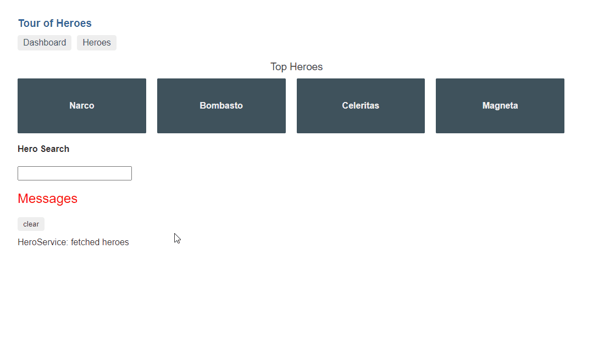
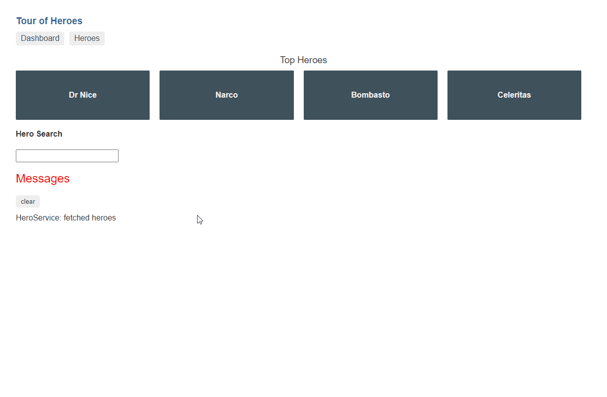
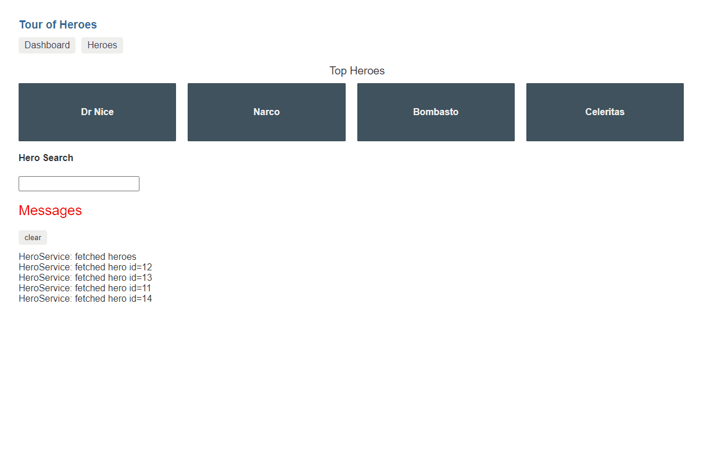

In this post, we're going to add [`rx-query`](https://github.com/timdeschryver/rx-query) to the Angular Tour of Heroes while pointing out the benefits of `rx-query`. Before we start, I just want to mention that `rx-query` is inspired by [react-query](https://react-query.tanstack.com/) and [SWR](https://github.com/vercel/swr/).

`rx-query` provides an easy way to fetch data over HTTP.
This is already the case withing Angular applications, so why should you care?
Because adding `rx-query` is no extra work, and you get some useful features for free.

## A query has a status

Making an HTTP request with `rx-query` is almost as simple as a normal request, just wrap the request with the `query` method and give it the query a key. The key is to distinguish multiple queries, it will become clear why this is important in the next sections.

```ts{4}:heroes.components.ts
import { query } from 'rx-query'

export class HeroesComponent {
  heroes$ = query('heroes-list', () => this.heroService.getHeroes())

  constructor(private heroService: HeroService) {}
}
```

Just like a normal request, the `query` method returns an Observable (`Observable<QueryOutput<T>>`). This Observable emits a value for each stage of the request (`success`, `error`, `loading`, `refreshing`). This is exposed with the `status` property on the output, and by using the status in combination with the [`ngSwitch` directive](https://angular.io/api/common/NgSwitch) it's easy to **show a different view for each stage of the request**.

While it's not required to create a view for the different stages, it requires the attention of the developer to think about the un-happy paths.
Leading to a better user experience.

```html:heroes.component.html
<ng-container *ngIf="heroes$ | async as query">
  <ng-container [ngSwitch]="query.status">
    <ul class="heroes" *ngSwitchDefault>
      <li *ngFor="let hero of query.data">
        <a routerLink="/detail/{{ hero.id }}">
          <span class="badge">{{ hero.id }}</span> {{ hero.name }}
        </a>
      </li>
    </ul>

    <div *ngSwitchCase="'loading'">Loading ...</div>
    <div *ngSwitchCase="'error'">Error ({{query.error}})</div>
  </ng-container>
</ng-container>
```

Resulting in the following:


## A query can have an input stream

The `heroes-list` query doesn't require an input because it's just fetching the whole list of heroes.
For queries that require an input parameter, there's an overload on `query` where you can pass a static parameter or an Observable parameter.
This makes it **easy to use**, for us as developers.

When an Observable is used as the input, the query callback is invoked, _with the (unwrapped) value_, when the Observable emits a new value.
This is useful for components that need to fetch data depending on a route parameter, for example, the details page of a hero.

> NOTE: For these queries, the input will be appended (by using the `JSON.stringify` method) to the key to generate a unique key.

```ts:hero-detail.component.ts
export class HeroDetailComponent {
  // Static parameter
  // Generates the key "hero-5" when the id is 5
  hero$ = query('hero', +this.route.snapshot.paramMap.get('id'), (id) =>
    this.heroService.getHero(id),
  )

  // Observable parameter
  // Generates the key when it receives a new input value
  hero$ = query('hero', this.route.params.pipe(map((p) => +p.id)), (id) =>
    this.heroService.getHero(id),
  )

  constructor(
    private route: ActivatedRoute,
    private heroService: HeroService,
  ) {}
}
```

## A query is cached

The reason you have to provide a key to the query is so that `rx-query` can cache the query.
The caching layer has three benefits:

1. it returns the cached data while the data is refreshed in the background;
1. it can ignore over-fetches when the state is still considered "fresh";
1. it ignores incoming requests for the same key while the same request is already pending;

Because a query is cached **the application feels faster** than the default behavior.
This is visible in the following two GIFs.





### Prefetch

We can use this cache to prefetch data so that the user doesn't have to wait after a navigation.
The `prefetch` method has the same signature as the `query` method but it doesn't return a result.

```ts
prefetch('hero', heroId, () => this.heroService.getHero(heroId))
```

If we create a reusable `prefetch` directive (like the one below), it becomes an easy task to prefetch data.

```ts:prefetch.directive.ts
@Directive({
  selector: '[prefetch]',
})
export class PrefetchDirective implements OnInit, AfterViewInit, OnDestroy {
  @Input()
  prefetchMode: ('load' | 'hover' | 'visible')[] = ['visible']
  @Output()
  prefetch = new EventEmitter<void>()

  observer: IntersectionObserver
  loaded = false

  constructor(private elemRef: ElementRef) {}

  ngOnInit() {
    if (this.prefetchMode.includes('load')) {
      this.prefetchData()
    }
  }

  ngAfterViewInit() {
    this.observer = new IntersectionObserver((entries) => {
      entries.forEach((entry) => {
        if (entry.isIntersecting) {
          this.prefetchData()
          this.observer.disconnect()
        }
      })
    })
    this.observer.observe(this.elemRef.nativeElement)
  }

  ngOnDestroy() {
    if (this.observer) {
      this.observer.disconnect()
    }
  }

  @HostListener('mouseenter')
  onMouseEnter() {
    if (!this.loaded && this.prefetchMode.includes('hover')) {
      this.loaded = true
      this.prefetchData()
    }
  }

  prefetchData() {
    if (navigator.connection.saveData) {
      return undefined
    }
    this.prefetch.next()
  }
}
```

Then we can prefetch the hero details as follow.

```ts{7}{25-27}:heroes.component.ts
@Component({
  selector: 'app-heroes',
  template: `
    <ng-container *ngIf="heroes$ | async as query">
      <ng-container [ngSwitch]="query.status">
        <ul class="heroes" *ngSwitchDefault>
          <li *ngFor="let hero of query.data" (prefetch)="prefetch(hero.id)">
            <a routerLink="/detail/{{ hero.id }}">
              <span class="badge">{{ hero.id }}</span> {{ hero.name }}
            </a>
          </li>
        </ul>

        <div *ngSwitchCase="'loading'">Loading ...</div>
        <div *ngSwitchCase="'error'">Error ... ({{ query.error }})</div>
      </ng-container>
    </ng-container>
  `,
})
export class HeroesComponent {
  heroes$ = query('heroes-list', () => this.heroService.getHeroes())

  constructor(private heroService: HeroService) {}

  prefetch(heroId: number) {
    prefetch('hero', heroId, () => this.heroService.getHero(heroId))
  }
}
```

Now, when a user navigates to the detail view, the details are instantly visible.


> There are other solutions to achieve the same result, for example with NgRx, which I wrote about in [Making your application feel faster by prefetching data with NgRx](https://timdeschryver.dev/blog/making-your-application-feel-faster-by-prefetching-data-with-ngrx).

## A query is retried

Sometimes a request can fail because the server timed out or when the server is in a bad state.
Before a query ends up in the `error` state, the query will be retried 3 times in the hope that it receives a successful response.
Because of this practice, **the user experience is improved**.

If there is already data present in the cache, that data will be used while a retry is pending.
The behavior is the same for when there is no data present, the query will stay in the `loading` state until the maximum numbers of retries are reached.

## A query is refreshed

State that is stored client site becomes stale. That's why `rx-query` offers multiple options to refresh its state.
Besides having a refetch after x milliseconds, it's also configurable to refetch the request when the window receives the focus.
This makes sure that the user will always **work with a fresh state**.

```ts{5-7}:dashboard.component.ts
export class DashboardComponent {
  heroes$ = query(
    'heroes-dashboard',
    () => this.heroService.getHeroes().pipe(map((h) => h.splice(0, 4))),
    {
      refetchOnWindowFocus: true,
    },
  )

  constructor(private heroService: HeroService) {}
}
```

## A query can mutate

Besides fetching data, `rx-query` also provides an API to save data with the `mutate` method.
Here again, `rx-query` helps to make the application feel faster because it's using **optimistic updates**.
Meaning that the state in the cache will be updated before the request is sent to the server.
If the request should fail, the cache automatically performs a rollback to its previous state.

To mutate the state, the `mutator` must be configured:

```ts{6-10}:hero-detail.component.ts
export class HeroDetailComponent {
  hero$ = query(
    'hero',
    +this.route.snapshot.paramMap.get('id'),
    (id) => this.heroService.getHero(id),
    {
      mutator: (hero) => {
        return this.heroService.updateHero(hero).pipe(tap(() => this.goBack()))
      },
    },
  )

  constructor(
    private route: ActivatedRoute,
    private heroService: HeroService,
    private location: Location,
  ) {}

  goBack(): void {
    this.location.back()
  }
}
```

To invoke the mutation, use the `mutate` method on the `QueryOutput` with the updated entity as the argument.

```html{13-15}:hero-detail.component.html
<ng-container *ngIf="hero$ | async as hero">
  <ng-container [ngSwitch]="hero.status">
    <div class="heroes" *ngSwitchDefault>
      <h2>{{ hero.data.name | uppercase }} Details</h2>
      <div><span>id: </span>{{ hero.data.id }}</div>
      <div>
        <label
          >name:
          <input #name [value]="hero.data.name" placeholder="name" />
        </label>
      </div>
      <button (click)="goBack()">go back</button>
      <button (click)="hero.mutate({ id: hero.data.id, name: name.value })">
        save
      </button>
    </div>

    <div *ngSwitchCase="'loading'">Loading ...</div>
    <div *ngSwitchCase="'error'">Error ... ({{ hero.error }})</div>
  </ng-container>
</ng-container>
```


### Update methods

The above GIF shows a problem. While the hero detail is updated, the dashboard still shows the hero detail from before the update.
It's only after the refresh of heroes list query, that the update is visible on the dashboard.

Therefore, `rx-query` exposes helper methods to update the state manually.

```ts{11,14,17}:hero-detail.component.ts
export class HeroDetailComponent {
  hero$ = query(
    'hero',
    +this.route.snapshot.paramMap.get('id'),
    (id) => this.heroService.getHero(id),
    {
      mutator: (hero) => {
        const updater = (heroes: Hero[]) => {
          return heroes.map((h) => (h.id === hero.id ? hero : h))
        }
        mutateOptimistic('heroes-dashboard', updater)

        return this.heroService.updateHero(hero).pipe(
          tap(() => mutateSuccess('heroes-dashboard')),
          tap(() => this.goBack()),
          catchError((err) => {
            mutateError('heroes-dashboard', err)
            return throwError(err)
          }),
        )
      },
    },
  )

  constructor(
    private route: ActivatedRoute,
    private heroService: HeroService,
    private location: Location,
  ) {}

  goBack(): void {
    this.location.back()
  }
}
```



## Wrapping up

`rx-query` has multiple benefits all aimed to improve the user experience and by keeping good developer ergonomics in mind.

From a functional side, the cache and refresh configuration options help to make your application feel faster, the automatic retries help to make the application more robust.

The developer receives configurable options to tweak the queries because every situation can be treated differently. `rx-query` forces the developer to think about how state is used. While working with `rx-query`, some of the following questions will emerge; Should it be cached, if so for how long? When do I want to refresh the state? What should we do when a request fails?

The benefits are clearly visible within the Tour of Heroes:

- the application is faster;
- the component code is trimmed down;
- there is an increase in the template code (HTML) to handle the different stages of the request;
- while working with cached state, it's easy to keep the state "fresh";

As a side note, `rx-query` can be more than a simple wrapper around an HTTP request at the component level.
It can:

- also be used in combination with other packages, for example with [@ngrx/component-store](https://ngrx.io/guide/component-store), where it can update the component state based on the query output
- also be used at a global level, for example with [@ngrx/effects](https://ngrx.io/guide/effects), where it can dispatch actions based on the query output

To start using `rx-query`, install the package with the following command.

```bash
npm install rx-query
```

To see it in action, take a look at the [live examples](https://timdeschryver.github.io/rx-query/).
The source code of these examples can be found in the [repository](https://github.com/timdeschryver/rx-query/tree/master/src/examples).
